<p align="center">
  <picture>
    <source media="(prefers-color-scheme: dark)" srcset="assets/logo-dark.svg">
    <source media="(prefers-color-scheme: light)" srcset="assets/logo-light.svg">
    
  </picture>
</p>

<p align="center">
  <a href="https://5uck1ess.github.io/cicero/"><b>📖 Documentation</b></a>
</p>

**Cicero is a self-hosted voice interface for coding agents: you speak, it answers out loud, and your agent does the actual work.** Install it next to the agent you already use, then talk to that agent from any browser on your network, or over a real phone call with the optional Telegram sidecar. Say *"fix the failing auth test and open a PR"*: Cicero acknowledges in about a second, the work happens in the background (commands you've gated, like a `git push`, need your spoken yes), and it tells you when the PR is up. With local providers, your audio never leaves your machine.

Cicero is [two layers](docs/concepts.md): Cicero itself, the same for everyone, and your office (your agents, models and hardware), which lives in your own config.

## What it feels like

```text
you    › Cicero, what's broken on CI?
cicero › Two things: lint on the API package, and the Postgres
         integration test timing out.
you    › Have the coder fix the lint one and open a PR.
cicero › On it — filed to the coder. I'll tell you when the PR is up.

         (four minutes later, unprompted)

cicero › The coder just finished "fix the CI lint failure" —
         the link's on your screen.
```

That's the shape: you speak, it acknowledges in about a second, the heavy work
runs outside the voice loop, and it comes back to you when there's news. The
delegation half needs a brain that can run async workers ([the
office](docs/office.md), an advanced setup); with a plain CLI brain you still get everything
conversational — ask, answer, run, interrupt.

## What makes it different

**Local voice in, pull requests out.** In detail:

- **~1 second to first spoken word** (on a local NVIDIA GPU) — local speech recognition, sentence-streamed speech synthesis, latency-covering filler clips. Measured end-to-end through a real tool-calling agent, not a parrot.
- **Any voice, cloned locally** — zero-shot cloning from a single reference WAV, down to **36–46 ms per sentence** ([audio.cpp](https://github.com/0xShug0/audio.cpp) pocket-tts, ggml/CUDA). Hand it a clip; that's Cicero's voice now.
- **Interrupt it mid-sentence** ("barge-in") — talk over Cicero on the browser and phone paths (and on the local mic when you enable full-duplex) and speech stops while cancellable brain adapters receive the interrupt; terminal-UI injection translates it to a bounded, best-effort terminal control. Only *speech* interrupts: a small local VAD model confirms a human is talking before anything cuts Cicero off, so keyboard clatter and background music don't — and with hands-free auto-start, the dormant page itself wakes when you speak. (Honest label: turn-taking with fast interruption — not a speech-to-speech model that comprehends while talking.)
- **Knows when you're done talking** — opt-in semantic end-of-turn detection ([Smart-Turn](docs/turn-detection.md), the same approach ChatGPT and Gemini voice use, here fully local): a tiny model (~8 M params, ~12 ms on CPU) reads the prosody and completeness of what you said instead of just timing the pause — so it can answer as soon as your sentence is complete instead of waiting out a silence timer, and keeps the mic open when you trail off mid-thought. Works on the browser path and the local mic; one `turn:` block in the config enables it.
- **Hears *how* you said it** — an optional speech-emotion sidecar ([emotion2vec](https://github.com/ddlBoJack/emotion2vec), CPU-only) classifies your tone in parallel with transcription and passes a confident non-neutral read to the agent — it knows the difference between "great" and *"great."* — at ~0 ms added latency, fully local.
- **A whole office behind one call** — lanes give you a team of agents, each with its own voice and personality: *"let me talk to the coder"* transfers the call, *"roll call"* makes everyone check in. Cicero speaks up on its own too: task finished, morning briefing, quiet hours respected.
- **Agent-agnostic by design** — the brain is a pluggable slot. Cicero owns the voice; your agent owns the doing.

## How a turn flows

<picture>
  <source media="(prefers-color-scheme: dark)" srcset="assets/turn-flow-dark.svg">
  <source media="(prefers-color-scheme: light)" srcset="assets/turn-flow-light.svg">
  
</picture>

Replies stream sentence by sentence, so speech starts while the front desk is still generating. Heavy work runs outside the voice loop, and Cicero tells you when it lands. Details are in [architecture](docs/architecture.md).

## Quickstart

```bash
git clone https://github.com/5uck1ess/cicero && cd cicero
bun install
bun run src/index.ts setup     # or: bun link, then cicero setup
```

Open the printed URL. The setup wizard asks what may leave your machine, sizes models to your hardware, finds your speech engines and agent, tests them, and writes `~/.cicero/config.yaml`. The full walkthrough is **[docs/setup.md](docs/setup.md)**; after that, **[Using Cicero](docs/using.md)**.

Want an AI agent to set it up for you? Tell Claude Code, Codex or any coding agent: *"set up Cicero for me using [INSTALL.md](INSTALL.md)"*.

**Supported agents:** Claude Code, Codex, Gemini, Qwen, any [ACP](https://agentclientprotocol.com) agent (Hermes, `codex-acp`, `claude-acp`, …), or any OpenAI-compatible model endpoint. See [choosing a brain](docs/brains.md).

**Just want your current agent to talk?** The [sidecar quickstart](docs/setup.md#sidecar-quickstart-claude-code-and-codex) makes a Claude Code or Codex session speak its replies in about two minutes, with no models and no config.

## Docs

The documentation site is **[5uck1ess.github.io/cicero](https://5uck1ess.github.io/cicero/)** ([docs map](https://5uck1ess.github.io/cicero/documentation)); the same pages are in [`docs/`](docs/README.md). Most-used: [setup](docs/setup.md) · [using Cicero](docs/using.md) · [concepts](docs/concepts.md) · [brains](docs/brains.md) · [web voice](docs/web-voice.md) · [notifications](docs/notifications.md) · [security](docs/security.md). Owner-specific material (the reference deployment, Hermes lanes and personalities, the Laya router) is under [Advanced](docs/advanced.md).

> **Project status:** active development. The [evaluation follow-up](docs/evaluation-follow-up-2026-07.md) records current limits. Files under `docs/superpowers/` are historical design records, not the backlog.

## Development

```bash
bun test                  # full test suite
bun run dev               # dev mode with watch
```

The default suite does not contact external agent services, even when `.env`
contains credentials. To run the opt-in Claude CLI smoke test, install and
authenticate Claude Code, then run:

```bash
CICERO_LIVE_TESTS=1 bun test tests/brain-claude-code-stream.test.ts
```

## License

MIT — see [LICENSE](LICENSE). Voice cloning is BYO-voice: Cicero ships no third-party voices, and cloning someone without consent is on you, not the tool — see [authorized use](docs/voice-cloning.md#authorized-use-only).
