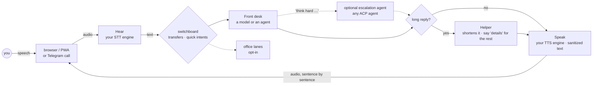
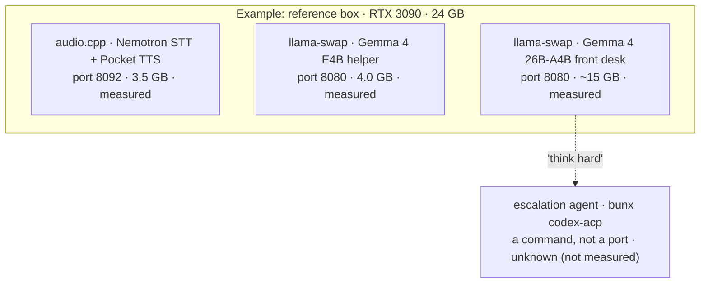

# Architecture

## Three shapes

- **Web-voice mode** — a headless GPU box serves a token-gated HTTPS voice page; you talk to it from any browser on the network (or over your VPN). Push-to-talk or hands-free VAD, streaming replies, barge-in, and an audio-reactive orb. This is the flagship experience. [Guide.](web-voice.md)
- **Sidecar mode** — Cicero attaches to whatever coding agent you're already using, summarizes its responses, and speaks them. Hands-free output for Claude Code, Codex, Gemini, Ollama, anything in a terminal. [Guide.](https://github.com/5uck1ess/cicero/blob/main/docs/superpowers/sidecar-modes.md)
- **Daemon mode (local mic)** — the same voice loop with a local mic/speaker on the box itself: mic in → STT → intent classification → brain dispatch → streaming TTS. [Guide.](daemon-mode.md)

All modes share the same summarization + TTS core.

## The turn pipeline (web-voice)

Audio reaches the daemon over a TLS WebSocket. Speech-to-text turns it into
words, the switchboard handles transfers and your own quick phrases instantly,
and everything else goes to the front desk. With a model front desk, "think
hard" hands one turn to the escalation agent. Replies are cut at sentence
boundaries, flattened from markdown into speech, and synthesized one sentence
at a time; the browser plays them and barge-in cancels the rest.

Key properties:

- **Sentence streaming end-to-end.** The brain's tokens are cut at sentence boundaries and each sentence is synthesized and shipped immediately — speech starts while the model is still generating. A pre-rendered filler clip covers the agent's first-token latency.
- **Barge-in through owned layers.** New speech (or typed text) stops Cicero's TTS queue and current audio. Signal-aware brain/provider adapters cancel in-flight generation; terminal-UI injection maps cancellation to a bounded, best-effort terminal interrupt. Local-mic voice-over-voice barge-in uses the opt-in full-duplex path and needs AEC or headphones for reliable open-speaker use.
- **Turn identity at the transport.** The v2 browser protocol binds every JSON and binary reply frame to a per-socket session ID and a per-utterance turn ID. Late output from an aborted turn is discarded at both server and browser, and each WebSocket owns its queue/cancellation state.
- **The switchboard runs before the brain.** Transfers ("talk to the coder"), roll call, "details", and user-defined quick intents have immediate lexical fast paths. Switchboard misses classify first (1500 ms default deadline), then act or dispatch one ordinary turn; classification adds about p50 330 ms on the reference local model; see [intent routing](office.md#intent-routing).
- **Speech is sanitized, text is not.** Markdown, code fences, list markers, and em-dashes are flattened to natural speech before TTS; the chat log keeps the rich text. Shouting is tamed at the same layer (repeated `!!!` collapse, ALL-CAPS words flatten — punctuation is a volume knob to a TTS engine), and LLM delivery tags like `[excited]` are stripped for engines that can't act on them, kept for ones that can.
- **Local model servers are supervised children.** The daemon launches and owns supported local STT/TTS/LLM processes. A configured remote or cloud provider is probed but not launched. A TTS fallback engine takes over per-sentence if the primary errors.
- **Conversation survives restarts.** Completed turns land in a JSONL history in `~/.cicero`; on boot, a recap primes the fresh agent session (colleague turns attributed to the colleague, so personas never leak across a restart).

## What runs where

The wizard sizes the front desk and helper to a **model budget**: total GPU
memory minus the speech engines and 1.5 GB of headroom. This is the reference
Linux box's layout, **as an example** (one NVIDIA RTX 3090, 24 GB):

The footprints come from the wizard's fit table. On NVIDIA, the Test step
measures what each engine and model actually uses with `nvidia-smi` and
replaces the estimates. Mac memory is not measured yet, so Mac values stay
estimates, and agents are never started during setup, so their footprint is
unknown.

## Components

- **Listener** — browser page (web-voice), stdin, or conversational voice mode (whisper STT + sox mic capture)
- **Switchboard** — exact fast paths plus model intent routing for lane transfers, roll call / standup, release, and dial-back. Quick intents and think-lane triggers retain their existing fast paths.
- **Brain** — a pluggable agent slot; one front desk plus optional lanes, each any ACP harness / CLI agent / model endpoint ([brains](brains.md))
- **Speaker** — streaming sentence-by-sentence TTS playback with barge-in; per-lane voices; sanitizer in front
- **Notify** — proactive voice-back: HTTP endpoint, kanban watch, Telegram notes/calls, quiet hours + briefing ([notifications](notifications.md))
- **Terminal Adapter** — Kitty, tmux, or WezTerm remote control for tab management, auto-detected; `none` for headless ([terminal adapters](https://github.com/5uck1ess/cicero/blob/main/docs/superpowers/terminal-adapters.md))

## Where your data lives

Local state stays in `~/.cicero/`, outside the repo: `config.yaml`, the voice
library (`voices/`), chat history, and queued notifications. With local
providers, STT and TTS stay on hardware you control and only text reaches the
configured brain. Remote STT receives utterance audio; remote/cloud TTS receives
text (and a cloud cloning provider may receive reference audio); Telegram calls
carry audio through Telegram. The selected brain may also be remote. See the
[security model](security.md) before enabling any egressing provider.
