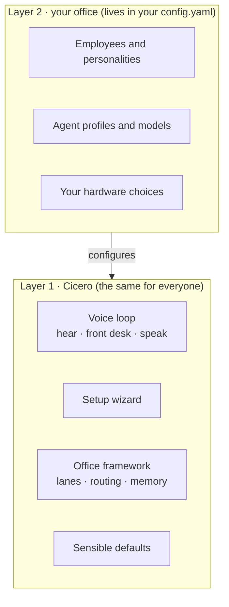

# Concepts: Cicero and your office

Cicero comes in two layers. Knowing which one you are touching tells you what
the wizard sets up and what stays yours.

## Layer 1: Cicero

The product itself, identical for every user: the voice loop (hear, answer,
speak, interrupt), the setup wizard, the office framework (employees, routing
between them, memory) and sensible defaults. Cloning this repository and
running [setup](setup.md) gives you layer 1.

## Layer 2: your office

Everything that is about *you*: which employees you have and how they talk,
which agent profiles and models they run, and which hardware they run on. It
lives in your `~/.cicero/config.yaml` and never in the product's defaults, so
nobody inherits someone else's office by installing Cicero. Packaging an office
so it can be shared (an "office pack") is planned for a later release.

### Default rule for employees

- **Coding work goes to the agent's native harness:** Claude Code or Codex,
  run the way their makers ship them.
- **Personalities that should remember and learn over time go to
  [Hermes](https://hermes-agent.nousresearch.com)**, which can run any model.

## What ships today

- **Employees and routing** exist as ACP office lanes (`brain.lanes`): several
  agents behind one call, transfers by voice, roll call. See
  [the office](office.md).
- **Employee templates and the office pack** are planned (setup v2, part 2).
- **Per-employee memory** is planned (setup v2, part 3).
- The setup wizard sets up layer 1 plus one front desk and one agent. It does
  not create employees yet.

## An example of layer 2

The project owner's own office (Hermes profiles, named characters, a
reference GPU box) is documented as one example of layer 2, not as a default:
see [Advanced / example deployment](advanced.md).
