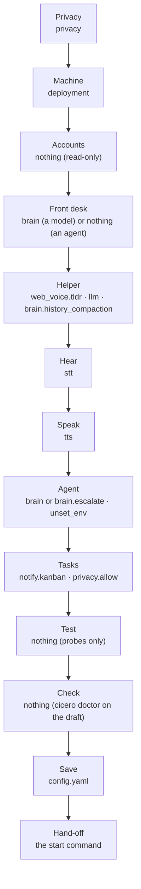
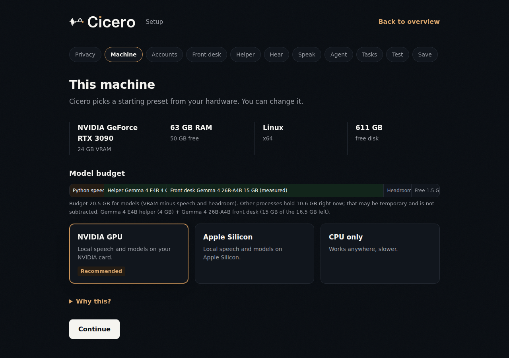

# Setup

This is the one setup path: clone Cicero, run the setup wizard, start it, and
talk. The wizard sets up [layer 1, Cicero itself](concepts.md), plus one front
desk and one agent. Your own office of employees comes later.

Prefer to have an AI agent do it? Point Claude Code, Codex or any other coding
agent at [`INSTALL.md`](https://github.com/5uck1ess/cicero/blob/main/INSTALL.md).
It asks you two questions and drives the same wizard headlessly (see
[Set it up with an AI agent](#set-it-up-with-an-ai-agent)).

## Before you start

- **[Bun](https://bun.sh)**, the runtime (`curl -fsSL https://bun.sh/install | bash`).
- **[uv](https://docs.astral.sh/uv/)**, which installs the Python speech
  engines (`curl -LsSf https://astral.sh/uv/install.sh | sh`).
- **ffmpeg and OpenSSL** (`sudo apt install ffmpeg openssl`, or brew/scoop).
  OpenSSL creates the web page's HTTPS certificate once.
- **A local model runtime** for the front desk and the helper, with a model
  loaded: llama.cpp behind llama-swap (`:8080`), [Ollama](https://ollama.com)
  (`:11434`) or LM Studio (`:1234`). The wizard tells you which model fits
  your machine and how to pull it.
- **A coding agent, if you want one**, installed and logged in: Claude Code,
  Codex, Gemini, Qwen, or an ACP agent such as Hermes or `codex-acp`. See
  [Choosing a brain](brains.md).

Linux with an NVIDIA GPU and macOS 14+ on Apple Silicon are the supported
wizard paths. CPU-only Linux and Windows run the same wizard with their
existing defaults.

## Start the wizard

```bash
git clone https://github.com/5uck1ess/cicero && cd cicero
bun install
bun run src/index.ts setup     # or: bun link, then cicero setup
```

It prints a URL with a one-time token; open it in a browser. Nothing is
written until you save, and it only writes when no config exists yet.

- `--lan` serves the page over HTTPS to other devices on your network, for a
  headless box. Accept the self-signed certificate once. If the box runs a
  firewall, pick a fixed `--port` and allow it from your LAN first (with ufw:
  `sudo ufw allow from 192.168.1.0/24 to any port <port> proto tcp`, deleted
  again when setup is done).
- `--home <dir>` writes to another directory instead of `~/.cicero`, so you
  can try setup without touching your real config. `cicero start` reads only
  the default home, so the hand-off shows the copy command.
- `--port <n>` picks the port (default: a free port).

The wizard walks these steps in order. Each box says what the step writes into
`~/.cicero/config.yaml`:





Each step is one question with a few option cards. A card says whether the
software is running, installed or not found, and the one that fits your
machine is marked *Recommended*. If you pick something that is missing, the
step shows how to install it and a *Check again* button. *Why this?* opens the
longer explanation.

## Privacy

**What may leave this machine?**

- **Nothing, unless I allow it** (the default). The front desk, the helper and
  speech must run here. A cloud coding agent or a hosted task board is offered
  only after you allow it, one item at a time, with a sentence saying what
  leaves.
- **Conversation may use cloud models.** The front desk and agents may be
  cloud services; the helper and speech still run here. Telegram and task
  boards still need their own allowance.

Writes `privacy: { mode: local | cloud, allow: [...] }`. This is a declared
policy, not a firewall: the wizard enforces it when you choose, and
`cicero doctor` warns when the config drifts from it. What each mode means day
to day is in [Using Cicero](using.md#privacy).

## Machine

Detects OS, CPU, RAM, free disk, Apple Silicon and NVIDIA VRAM, and works out
the **model budget**: how much memory the front desk and helper may use once
speech and headroom are set aside. It recommends a starting preset (NVIDIA
GPU, Apple Silicon or CPU only). Writes `deployment: local-cuda | local-mlx |
local-cpu`.

## Accounts

Shows which login or API key each agent will most likely use, and who bills
it. An API key in your environment can silently override a subscription login
(`claude` prefers `ANTHROPIC_API_KEY`, for example). Ticking **Use my
subscription** removes that key from the agent's environment only; the Agent
step writes it as `unset_env`. Logins and keys are reported as found or not
found, never read or stored. This step writes nothing itself.

## Front desk

What answers when you talk:

- **A model** (fast, no tools). It answers in about a second and hands
  coding work to your agent when you say "think hard". The wizard lists the
  models loaded in llama-swap/llama.cpp, Ollama and LM Studio and recommends
  one that fits the budget. With cloud privacy it can also be a cloud model
  (the key stays in your environment, never in the config). Writes `brain`.
- **An agent** (slower, uses tools). The agent you pick on the Agent step
  answers everything. Writes nothing here.

## Helper

A small local model that shortens long spoken replies (say "details" for the
rest) and summarizes old conversation history so long sessions keep their
context. In local privacy mode it is required. Writes
`web_voice.tldr.summarizer_url`/`summarizer_model`, `llm`, and
`brain.history_compaction.enabled` when **Compress long conversations** is
ticked. With no helper and a cloud front desk, `llm` points at the front
desk's model instead.

If a runtime isn't running, the step shows how to get the recommended model,
for example `ollama pull gemma4:e4b-it-qat`, or a llama-swap entry with the
settings the budget assumes (64k context, q8 KV cache).

## Hear

Speech-to-text. The hardware tier picks the starting engine, and each option
shows whether its environment is installed and its port is up. Writes `stt`.

## Speak

Text-to-speech. Same checks as Hear, plus a **Play sample** button that
speaks one sentence through the running engine (it never starts one). Writes
`tts`. Voice cloning comes after setup: see [Voice cloning](voice-cloning.md).

### Speech choices on a CUDA box

On Linux with a detected NVIDIA GPU, **Hear** offers **Nemotron (audio.cpp)**
and **Speak** offers **Pocket TTS (audio.cpp)**. Both use the same CUDA server on
port 8092. The Python **Pocket TTS (Python)** choice remains available as a
separate sidecar. The page detects the audio.cpp binary, the selected model
directory, port 8092, and whether a reachable server lists that model at
`/v1/models`. It recommends audio.cpp for a `local-cuda` setup when the binary
and model directory exist. If a server is running, it must list the model.
When those conditions fail, the page keeps the usual faster-whisper or Kokoro
recommendation.

Build audio.cpp with `scripts/provision-audiocpp.sh`. This script builds the
CUDA server but does **not** download model weights. Place Nemotron weights in
`vendor/audio.cpp/models/nemotron-3.5-asr-streaming-0.6b` and Pocket TTS
weights in `vendor/audio.cpp/models/pocket-tts` manually. The repository has no
confirmed automated download path for these two model directories. See the
[audio.cpp voice setup](voice-cloning.md#quickstart--local-realtime-audiocpp-pocket-tts)
for the documented Pocket TTS path; verify the Nemotron weights and layout with
the audio.cpp project before starting the server.

Saving either audio.cpp choice writes its model ID and port into
`~/.cicero/config.yaml` and creates or extends
`servers/audiocpp_server.local.json` in the checkout. Setup adds only the
selected model entries and keeps existing entries and other JSON keys. The
server JSON is machine local and ignored by Git. If that file already uses a
different port or model entry with the same ID, inspect and reconcile it
manually before starting Cicero; setup preserves existing values.

The optional STT live streaming checkbox adds `stt.streaming: true` and writes
Nemotron's model entry with `"mode": "streaming"`. When Nemotron already has an
entry, setup updates its mode and preserves its other keys. Restart audio.cpp
after changing the model mode. Live streaming affects browser voice only.

## Agent

The coding agent. What it does depends on the front desk:

- **Model front desk:** the agent is an *escalation* agent. The front desk
  hands it a turn when you say "think hard" (see
  [Using Cicero](using.md#thinking-harder)). This needs an ACP agent (Hermes,
  `codex-acp`, `claude-acp`, `grok-acp`, or your own ACP command), or none.
  Writes `brain.escalate`.
- **Agent front desk:** the agent answers everything: Claude Code, Codex,
  Gemini, Qwen, an ACP agent, or a model API. Writes `brain`.

In local privacy mode, a cloud agent needs **Allow this agent to use the cloud**
ticked, which adds `agent` to `privacy.allow`. ACP agents are checked on
`PATH` and stay "unverified until first call".

## Tasks

Optional. Detects `hermes`, `multica` or `paperclipai` and probes the board
once. A board holds your task text, so it needs **Allow task text to go to
this board** ticked in either privacy mode, which adds `board` to
`privacy.allow`. Writes `notify.kanban`. Cicero only watches the board; the
board owns the tasks.

## Test

Tries each running part once. Each probe has its own Run button, a deadline
and a Cancel button:

- **Hear:** transcribes a bundled clip and compares the words.
- **Front desk:** one short answer from a model front desk. An agent is never
  run here; it shows as installed and is tested on your first call.
- **Helper:** one summary.
- **Speak:** use **Play sample** on the Speak step; the browser plays it.
- **Memory:** on NVIDIA, measures what each engine and model really uses with
  `nvidia-smi` and shows it in the Memory row, next to the Machine bar's
  fit-table values. Mac memory is not measured, and its fit is labeled an
  estimate.

A later choice clears the results. Failures never block saving.

## Check

Runs the same checks as `cicero doctor` against a private temporary copy of
the draft. Config errors block saving. Engines that are not installed or
running yet are listed with the command that fixes them, and you confirm
before saving.

## Save

Writes a private, annotated `~/.cicero/config.yaml` with a comment on every
key, including a stable random `web_voice.token`. It only writes when no
config exists. An invalid existing config is backed up only if you click
*Back up old config and start fresh*.

## Hand-off

Shows the command to start Cicero and how to pair a phone. *Finish and close
setup* stops the setup page; it does not start the daemon.

### What the wizard writes for a Claude Code setup

For cloud privacy, Claude Code as the front desk, a local Gemma 4 E4B helper
on llama-swap, faster-whisper and Kokoro, the saved file comes down to this
(comments and the random `web_voice.token` left out; with **Compress long
conversations** ticked, `brain` also gets `history_compaction: { enabled: true }`):

```yaml cicero-config
deployment: local-cuda
headless: true
privacy: { mode: cloud }
brain: { backend: claude-code, mode: subprocess }
web_voice:
  enabled: true
  tldr: { summarizer_url: http://127.0.0.1:8080/v1, summarizer_model: gemma4-e4b }
llm: { backend: openai, baseUrl: http://127.0.0.1:8080/v1, model: gemma4-e4b }
stt: { backend: faster-whisper }
tts: { backend: kokoro }
```

Every key is documented in
[`config.yaml.example`](https://github.com/5uck1ess/cicero/blob/main/config.yaml.example),
the reference for every option. You don't need to copy it.

## Start and pair

```bash
cicero doctor   # re-checks everything and prints fixes
cicero start    # or: bun run src/index.ts start
# → 🎙️  Web voice server on https://0.0.0.0:8090 (token required)
```

To use Cicero from your phone, run this with the daemon running:

```bash
cicero pair
```

The command ensures `web_voice.token` is a stable random credential, prints the
phone URL, and renders the same URL as a terminal QR code. If it creates or
replaces the token, restart the daemon once and re-run `cicero pair`. The QR
contains the live credential; use `cicero pair --no-token-in-qr` to scan only
the address and type the separately printed token on the phone.

When no `web_voice.tunnel` block is configured, `pair` prints the exact
one-line block to add but does not make that second config change. With a
daemon-owned tunnel, the published tunnel URL wins over the LAN URL.
Cloudflared quick-tunnel URLs change on every daemon run, so re-run `pair` after
each restart; Tailscale hostnames are stable. The manual URL and certificate
flow below remains available.

Open `https://<box-ip>:8090/?token=<token>`, accept the self-signed
certificate once, and click **Start conversation** (the page loads with it
off). Hold SPACE or the orb and say **"What can you help me with?"** You
should hear a reply. Do this one real turn before treating a setup as ready:
`cicero doctor` cannot prove that an agent's login works. Page controls,
hands-free mode and the PWA are in the [web voice guide](web-voice.md); what
to say next is in [Using Cicero](using.md).

**If something is off:**

- **The browser warns about the certificate.** Expected: Cicero makes a
  self-signed HTTPS certificate on first start, because browsers only give the
  microphone to HTTPS pages. Accept it once per device.
- **I talk and nothing happens.** Click **Start conversation** first, then
  hold SPACE or the orb *while* speaking. Then check the browser's microphone
  permission, then `cicero doctor`.
- **`doctor` is green but turns fail.** Run the agent's own CLI once by hand
  to confirm it is logged in, then try a real turn again.

## Manual steps the wizard doesn't do yet

The wizard has no Channels or Install step yet, so these stay manual.

- **Install the speech engines you chose.** Hear and Speak show the exact
  command for your choice, and `cicero doctor` repeats it. The common ones:

  ```bash
  uv venv .venv-stt --python 3.10 && uv pip install --python .venv-stt -r requirements/faster-whisper.txt
  uv venv .venv-kokoro --python 3.11 && uv pip install --python .venv-kokoro -r requirements/kokoro.txt
  uv venv .venv-pocket --python 3.11 && uv pip install --python .venv-pocket -r requirements/pocket-tts.txt
  ```

- **audio.cpp model weights** are downloaded by hand (see "Speech choices on a
  CUDA box" above).
- **Telegram** (messages and calls): see [Notifications](notifications.md) and
  the [call sidecar guide](https://github.com/5uck1ess/cicero/blob/main/sidecars/telegram-call/README.md).
  In local privacy mode, add `telegram` to `privacy.allow` or `cicero doctor`
  warns.

## Set it up with an AI agent

The wizard's detection, choices and checks also run headlessly, for an AI agent
working for you. [`INSTALL.md`](https://github.com/5uck1ess/cicero/blob/main/INSTALL.md)
is the agent's script; the commands are:

```bash
bun run src/index.ts setup --plan --json --privacy local --agent codex-acp > plan.json
bun run src/index.ts setup --apply answers.json      # answers.json = plan.recommended, edited
bun run src/index.ts setup --test --json             # once the engines are running
bun run src/index.ts doctor --json
```

- `--plan` reads only. It prints `detected` (each step's detection),
  `recommended` (an answers file ready to apply), `reasons` (one line per
  choice) and `blocked` (steps it could not fill, with the fix). Credentials
  show only as found or not found.
- The answers file is `{ version: 1, privacy: {…}, steps: { <step>: <choice> } }`,
  one entry per choice step (`privacy`, `system`, `accounts`, `frontdesk`,
  `helper`, `stt`, `tts`, `brain`, `board`), each exactly what the page posts.
- `--apply` re-runs detection and parses every choice through the same code
  and probes as the page, runs the same Check, and writes through the same
  rules: it never overwrites an existing config. Engines that aren't ready yet
  need `--acknowledge-not-ready`; an invalid existing config is backed up only
  with `--backup-invalid`.
- `--test` runs Test's probes against running engines and reports Speak as
  skipped (no browser).

## Platform variants

The wizard is the same everywhere; only the prerequisites differ.

### macOS 14+ (Apple Silicon)

```bash
brew install uv sox openssl ffmpeg
bun install
bun run src/index.ts setup
```

The Machine step recommends the MLX stack (`local-mlx`). The current MLX
dependency floors need macOS 14 or newer. For terminal tab integration, use a
terminal with remote control ([Kitty](https://sw.kovidgoyal.net/kitty/),
[tmux](https://github.com/tmux/tmux) or [WezTerm](https://wezterm.org/));
`terminal: none` runs headless. See
[terminal adapters](https://github.com/5uck1ess/cicero/blob/main/docs/superpowers/terminal-adapters.md).

### Windows (CUDA)

```bash
powershell -c "irm bun.sh/install.ps1 | iex"      # Bun
scoop install uv sox ffmpeg tmux openssl          # uv, audio tools, tmux, OpenSSL
bun install
bun run src/index.ts setup
```

The venv commands above work the same on Windows. OpenSSL is needed only to
create the first web-voice certificate; `cicero doctor` reports it when it is
missing.

## Optional macOS MLX stack and native helper

The existing MLX and native-hotkey recipe is an alternative to the reference
speech-server installation above:

```bash
bun install
brew install sox openssl ffmpeg
uv venv .venv --python 3.12
uv pip install --python .venv -r requirements/mlx.txt --prerelease=allow

bun run build:hotkey    # optional — macOS Ctrl+Shift+Space helper
bun link

bun run src/index.ts doctor
cicero start --tts
```

## Run at boot

Ship it as a systemd user service (no Docker needed; the daemon supervises its own model servers):

Set a stable `web_voice.token` before enabling the service. Systemd retains
service stdout in the journal, including the one-run token printed when that
setting is omitted.

```bash
cp deploy/cicero.service ~/.config/systemd/user/   # edit WorkingDirectory first
systemctl --user enable --now cicero
loginctl enable-linger $USER                        # keep it alive when logged out
```

## Optional VibeVoice, Smart-Turn, and speech-emotion stacks

VibeVoice's published `vibevoice-api==0.0.1` wheel is not standalone: its server
imports the separate `vibevoice` model package, but the wheel does not declare
or include it. Cicero therefore pins the upstream
[`VibeVoice`](https://github.com/vibevoice-community/VibeVoice) and
[`VibeVoice-API`](https://github.com/vibevoice-community/VibeVoice-API) source
snapshots in `requirements/vibevoice-sources.txt`, along with the server's
undeclared direct imports. Keep that stack in its own Python 3.11 environment
(Git is required so `uv` can fetch the pinned snapshots):

```bash
uv venv .venv-vibevoice --python 3.11
uv pip install --python .venv-vibevoice -r requirements/vibevoice.txt
```

No manual checkout or separately started server is needed: the manifest owns
the source revisions, and Cicero launches `python -m vibevoice_api.server`.
The selected model weights download on first launch. See [voice
cloning](voice-cloning.md) for the backend config and reference-clip workflow.

Smart-Turn has a dedicated, small Python 3.11 environment on every platform.
This avoids changing the MLX or faster-whisper dependency graph:

```bash
uv venv .venv-turn --python 3.11
uv pip install --python .venv-turn -r requirements/turn.txt
```

Existing installations that previously put Smart-Turn in `.venv-stt` or
`.venv` continue to launch during migration, in that order, but Cicero logs a
deprecation warning with the command above. `.venv-turn` is always preferred;
create it before removing Smart-Turn packages from either shared environment.

Speech-emotion recognition stays isolated because FunASR's PyTorch/ModelScope
graph can conflict with STT dependencies:

```bash
uv venv .venv-ser --python 3.11
uv pip install --python .venv-ser -r requirements/ser.txt --index-strategy unsafe-best-match
```

The files under [`requirements/`](https://github.com/5uck1ess/cicero/blob/main/requirements/README.md) constrain direct
dependencies only. Accelerator-specific transitive packages remain resolved
for the host rather than being presented as one universal lockfile.

## Sidecar quickstart (Claude Code and Codex)

The zero-commitment entry point: Cicero attaches to the coding agent you already use and speaks its responses.

```bash
bun install
bun link

# One-time: install one or both native Stop hooks
cicero hook install claude-code
cicero hook install codex

# Each session: run the receiver in a separate terminal
cicero hook
```

The installers and receiver share an automatically generated bearer credential in `~/.cicero/hook-token`; no token needs to be copied into config. Before changing an existing agent settings file, the installer writes one private timestamped backup; an already-current reinstall is a no-op and does not accumulate backups. Claude Code posts its response directly to the loopback receiver. Codex runs a bounded local bridge; open `/hooks` once after installation and trust that command hook. Native-hook sessions then speak summarized responses through Cicero's TTS. See [`sidecar modes`](https://github.com/5uck1ess/cicero/blob/main/docs/superpowers/sidecar-modes.md) for terminal-scrape mode (Gemini / Ollama / any CLI agent without hooks) and config.

**For real summaries** (not raw token blobs), point Cicero at a local LLM — install [Ollama](https://ollama.com) and add to `~/.cicero/config.yaml`:

```yaml
llm:
  backend: ollama
  port: 11434
  model: qwen3:0.6b
```

Without an LLM the sidecar still works — it falls back to speaking the last line of the response.

## Remote model servers

Run the heavy models on one machine (e.g. a Windows/Linux GPU box) and drive Cicero from another. Any HTTP backend — `faster-whisper`, `mlx-whisper`, `mlx-audio`, `kokoro`, `vibevoice`, `mlx-lm`, `ollama`, `llama-cpp` — accepts a `host`:

```yaml
# ~/.cicero/config.yaml on the laptop — point each backend at the GPU box
stt: { backend: faster-whisper, host: 192.168.1.50, port: 8083, timeout_ms: 90000 }
tts: { backend: mlx-audio,      host: 192.168.1.50, port: 8082, timeout_ms: 60000 }
llm: { backend: llama-cpp,      host: 192.168.1.50, port: 8080, timeout_ms: 120000 }   # llama-server (e.g. Gemma GGUF)
```

The `llama-cpp` backend talks to llama.cpp's `llama-server` over its OpenAI-compatible `/v1/chat/completions` API. Run your own server (`llama-server -m gemma.gguf --port 8080`) and Cicero connects to it; or set `llm: { backend: llama-cpp, model: /path/to/gemma.gguf }` to have Cicero launch one locally. `llama-server` also supports GBNF/json-schema constrained decoding.

When `host` is a non-local address Cicero connects directly and does **not** launch a local server for that backend. Omit `host` (or use `localhost`) to keep the model on the same machine. For Home Assistant voice servers, use the [Wyoming backends](https://github.com/5uck1ess/cicero/blob/main/docs/superpowers/wyoming-integration.md) instead.

## CLI reference

```bash
# Setup
cicero setup                         # the setup page (prints its URL)
cicero setup --lan --port 8443       # serve it to other devices on your network
cicero setup --home /tmp/try         # try setup without touching ~/.cicero
cicero setup --plan --json --privacy local|cloud [--agent <id>]   # headless: detect and recommend
cicero setup --apply answers.json [--acknowledge-not-ready] [--backup-invalid]
cicero setup --test --json           # probe the running engines

# Sidecar mode
cicero hook install claude-code      # install the Stop hook (one-time)
cicero hook install codex            # install the native Codex Stop hook
cicero hook                          # run the hook receiver
cicero scrape <tab>                  # terminal-scrape an agent without hooks

# Daemon mode
cicero start --tts                   # start the daemon with TTS
cicero start --no-tts                # without TTS
cicero start --no-servers            # keyword routing only, no model servers
cicero stop                          # stop the daemon
cicero status                        # bounded effective-config/runtime snapshot
cicero doctor                        # check every configured backend, print fixes
cicero doctor --json                 # the same checks as JSON ({ version, checks, fails, warns })
cicero pair                          # print the phone URL and credential-bearing QR
cicero pair --no-token-in-qr         # scan the URL, then type the token separately
cicero swap stt faster-whisper       # replace a live speech provider without restarting
cicero swap tts audiocpp org/voice-model   # optional trailing model override

# Dictation (opt-in; see docs/dictation.md)
cicero dictate                       # toggle: press once to start, again to stop

# Utility
cicero speak "Hello from Cicero"     # speak arbitrary text
echo "build done" | cicero speak     # pipe-friendly
cicero notify "PR is up."            # speak through every connected browser

# Voices
cicero voice add butler ~/ref.wav --provider pocket-tts  # match the configured TTS engine
cicero voice use butler              # set the active voice
cicero voice list / inspect / remove

# Override brain at startup
cicero start --brain qwen
cicero start --brain-mode subprocess
```
